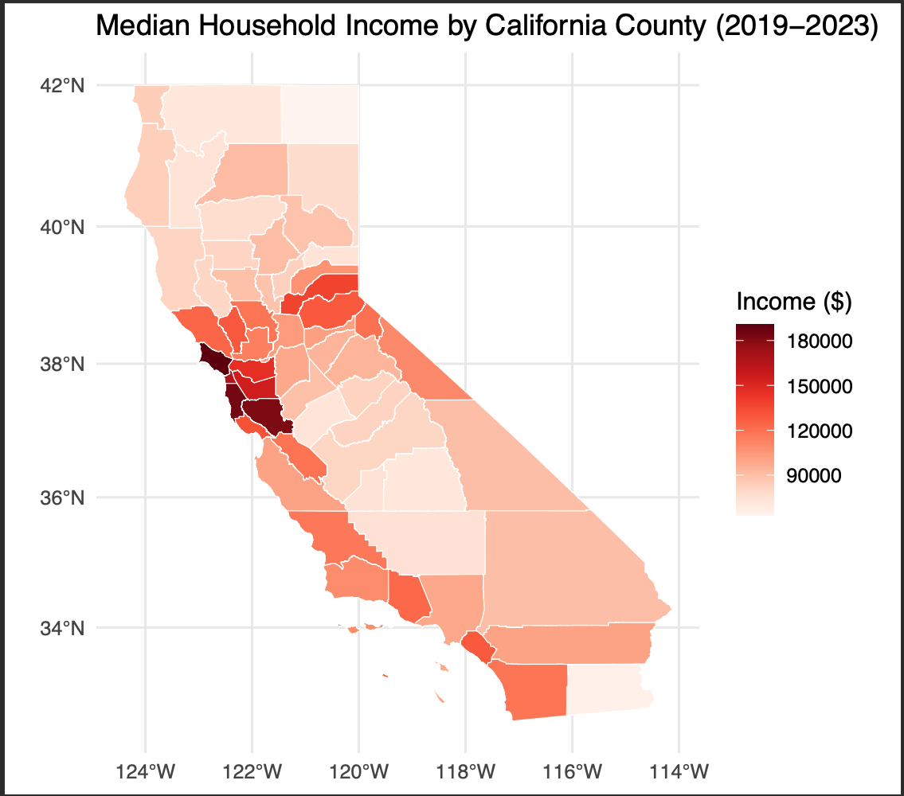

# California County Income Map (2019–2023)

A choropleth map visualizing median household income across all 58 California 
counties, built in R using public Census/ACS data and geospatial shapefiles.



---

## Key Findings

- **3x income gap** within a single state: Marin County (~$190K) vs. 
  Modoc County (~$63K)
- Wealth is heavily concentrated around the **San Francisco Bay Area** 
  (Marin, San Mateo, Santa Clara), driven by the tech sector
- A clear **urban-rural divide**: inland and northern counties consistently 
  fall below the state median of ~$110K
- Surprising outliers: **El Dorado and Nevada counties** near Lake Tahoe 
  show above-average incomes despite being rural, likely driven by remote 
  workers and affluent retirees relocating from the Bay Area

---

## Tools & Skills

- **Language:** R
- **Libraries:** `tidyverse`, `sf`, `ggplot2`
- **Data wrangling:** CSV import, string cleaning, column renaming, joins
- **Geospatial:** Merging shapefile data with tabular income data via `left_join`
- **Visualization:** Choropleth map with continuous color gradient

---

## Data Sources

- **Income data:** [HDPulse Data Portal](https://hdpulse.nimhd.nih.gov) — 
  U.S. Dept. of Health & Human Services, 5-year ACS estimates (2019–2023)
- **Shapefiles:** California State Geoportal — county boundary polygons

---

## How to Run

1. Clone this repository
2. Download the California county shapefile from the 
   [CA State Geoportal](https://gis.data.ca.gov/) and place it in the 
   project folder
3. Open `mapping.R` in RStudio
4. Install dependencies if needed:
```r
   install.packages(c("tidyverse", "sf", "ggplot2"))
```
5. Run the script — the map will render in your RStudio plot window

---

## Summary Statistics

| | County | Median Income |
|---|---|---|
| **Highest** | Marin County | $190,681 |
| | San Mateo County | $184,583 |
| | Santa Clara County | $182,053 |
| **Lowest** | Modoc County | $62,857 |
| | Imperial County | $64,569 |
| | Tulare County | $71,096 |

---

*Project completed by Alper Burak Urk*
